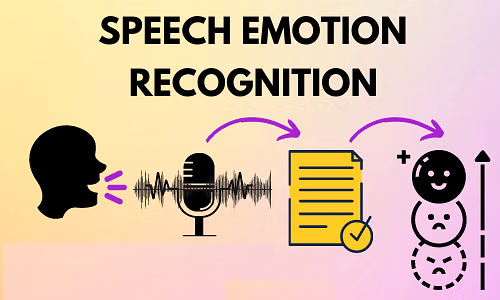

# Data Science Portfolio
---
## Machine learning

### Fraud Detection

Fraud detection is a set of processes and analyses that allow businesses to identify and prevent unauthorized financial activity. This can include fraudulent credit card transactions, identify theft, cyber hacking, insurance scams, and more.

---
## Deep Learning
### Speech Recognition System for Emotion Detection

This project focuses on detecting human emotions from speech signals using Machine Learning and Deep Learning techniques. The system analyzes audio features such as pitch, tone, frequency, and intensity to identify emotions like happiness, sadness, anger, fear, and neutrality.

The project involves audio preprocessing, feature extraction using MFCC (Mel Frequency Cepstral Coefficients), and training classification models to improve emotion prediction accuracy. A user-friendly interface is also integrated to allow real-time emotion detection from voice input.

**##Technologies Used**
Python
TensorFlow / Keras
Librosa
NumPy & Pandas
Flask / Streamlit
Scikit-learn

---

